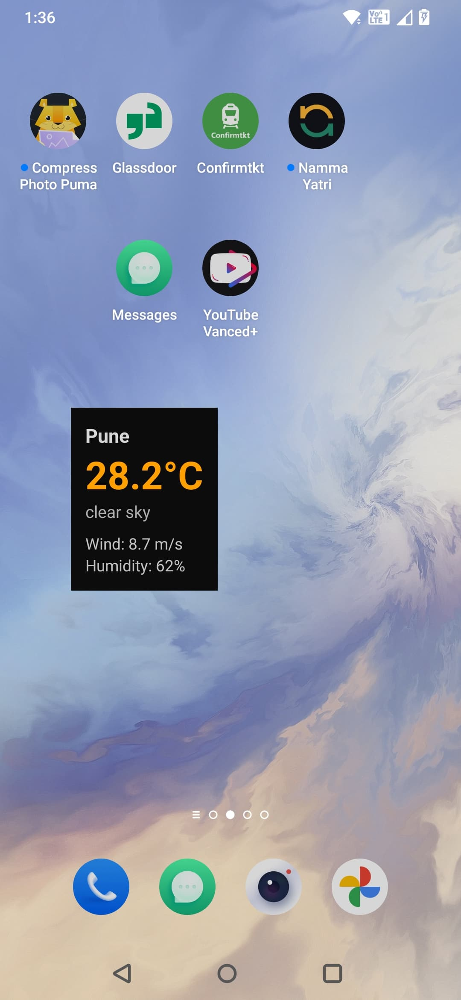
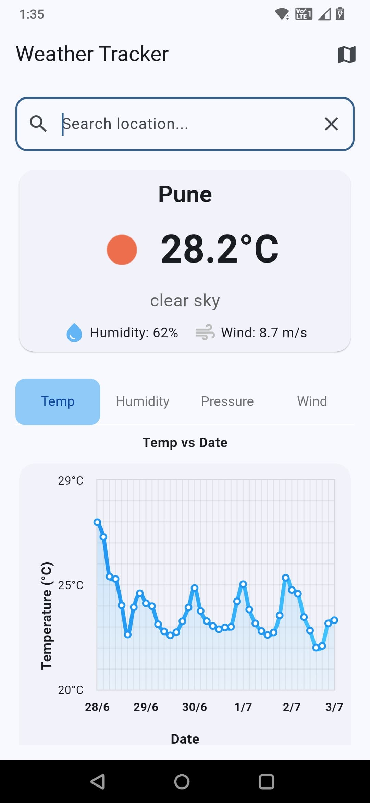
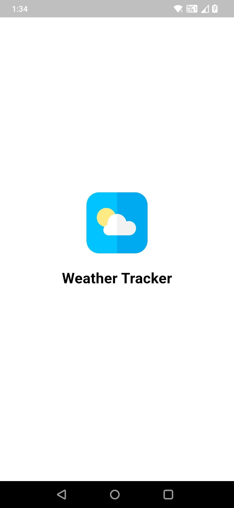

# Weather Tracker - Flutter Application

A modern, responsive Flutter weather application that displays real-time weather data and forecasts using OpenWeatherMap API, with interactive maps and Android home screen widget support.

## 🌟 Features

### Home Page
- **Current Weather Display**: Prominent temperature, weather condition, and icons
- **Interactive Forecast Chart**: Multi-tab chart (Temperature, Humidity, Pressure, Wind) using fl_chart
- **Location Management**: 
  - Automatic GPS location detection with permission handling
  - Manual city search functionality
  - Location services status monitoring
- **Responsive Design**: Adapts to all screen sizes using ScreenSizeUtil
- **Lifecycle Awareness**: Auto-refreshes weather data when returning from background

### Map Page
- **Interactive Map**: Weather map with location selection
- **Location Memory**: Remembers last selected location
- **Weather Integration**: Updates home screen weather when location is selected
- **Cross-platform Support**: Works on mobile and web

### Android Home Widget
- **Weather Widget**: Displays current weather on Android home screen
- **Auto-updates**: Widget updates when app fetches new weather data
- **Click to Open**: Tapping widget opens the main app
- **Real-time Data**: Shows temperature, condition, and location

### Splash Screen
- **App Branding**: Clean splash screen with app logo and title
- **Smooth Transition**: Automatic navigation to home page after delay
- **First Launch Only**: Shows only on app startup

## 📱 Screenshots

### Home Screen

*Current weather display with interactive forecast chart*

### Map Screen

*Interactive map for location selection*

### Android Widget

*Home screen widget showing current weather*

### Forecast Chart

*Multi-tab forecast chart with temperature, humidity, pressure, and wind data*

### Splash Screen

*App splash screen with branding*

## 🎥 Demo Video

### App Walkthrough
[](assets/videos/app_demo.mp4)
*Click to watch the full demo video*

### Quick Demo (GIF)

*Quick overview of app features and navigation*

### Technical Features
- **Clean Architecture**: SOLID principles with Domain, Data, and Presentation layers
- **State Management**: BLoC pattern for predictable state management
- **Navigation**: GoRouter for type-safe navigation
- **Dependency Injection**: GetIt for service locator pattern
- **Error Handling**: Comprehensive error handling for network, API, and permission issues
- **Responsive Design**: ScreenSizeUtil for adaptive UI across devices
- **Cross-platform**: Supports Android, iOS, and Web
- **Modern Packages**: Latest Flutter packages and best practices

## 🏗️ Architecture

### Clean Architecture Implementation
```
lib/
├── core/
│   ├── constants/          # App constants and configuration
│   ├── errors/            # Failure classes and error handling
│   ├── network/           # Network connectivity and API setup
│   ├── utils/             # Utility classes (ScreenSizeUtil)
│   ├── widgets/           # Reusable UI components
│   ├── di/                # Dependency injection setup
│   └── router/            # GoRouter configuration
├── features/
│   ├── weather/           # Weather feature
│   │   ├── data/          # Data layer (models, repositories, data sources)
│   │   ├── domain/        # Domain layer (entities, use cases, repositories)
│   │   └── presentation/  # Presentation layer (BLoC, pages, widgets)
│   ├── location/          # Location feature
│   │   ├── data/          # Location data handling
│   │   ├── domain/        # Location domain logic
│   │   └── presentation/  # Location UI and state
│   ├── map/               # Map feature
│   │   └── presentation/  # Map UI and integration
│   └── splash/            # Splash screen feature
│       └── presentation/  # Splash screen UI
```

### State Management Choice: BLoC
**Why BLoC?**
- **Predictable State**: Clear state transitions and event handling
- **Testability**: Easy to unit test business logic
- **Separation of Concerns**: UI logic separated from business logic
- **Reusability**: BLoCs can be reused across different widgets
- **Team Experience**: Consistent with existing team practices

### Dependencies Used
- **flutter_bloc**: State management
- **go_router**: Navigation
- **dio**: HTTP client for API calls
- **flutter_map**: Maps integration (replaces Google Maps for better cross-platform support)
- **geolocator**: Location services
- **geocoding**: Address geocoding
- **connectivity_plus**: Network connectivity
- **fl_chart**: Charts for weather forecast with multiple data types
- **get_it**: Dependency injection
- **flutter_dotenv**: Environment variable management (mobile/desktop only)
- **equatable**: Value equality
- **dartz**: Functional programming (Either type)
- **home_widget**: Android home screen widget support
- **permission_handler**: Location permission handling
- **shared_preferences**: Local data storage
- **cached_network_image**: Image caching
- **shimmer**: Loading animations

## 🚀 Setup Instructions

### Prerequisites
- Flutter SDK (3.6.1 or higher)
- Dart SDK (3.6.1 or higher)
- Android Studio / VS Code
- Git

### Installation

1. **Clone the repository**
   ```bash
   git clone <repository-url>
   cd weathertracker
   ```

2. **Install dependencies**
   ```bash
   flutter pub get
   ```

3. **Configure API Keys**
   
   **For Mobile/Desktop:**
   Create `assets/.env` file:
   ```env
   OPENWEATHER_API_KEY=your_openweather_api_key_here
   ```
   
   **For Web:**
   Update `lib/core/constants/app_constants.dart`:
   ```dart
   static const String openWeatherApiKeyWeb = 'your_public_api_key_here';
   ```

4. **Get API Keys**
   
   **OpenWeatherMap API Key:**
   - Visit [OpenWeatherMap](https://openweathermap.org/api)
   - Sign up for a free account
   - Get your API key from the dashboard

5. **Platform-specific setup**

   **Android:**
   - Location permissions are handled automatically
   - Home widget is configured automatically
   - No additional setup required

   **iOS:**
   - Location permissions are handled automatically
   - No additional setup required

   **Web:**
   - No additional setup required
   - Uses public API key from constants

6. **Run the application**
   ```bash
   flutter run
   ```

## 📱 Usage

### Home Page
- **Automatic Location**: App automatically detects your location and shows current weather
- **Permission Handling**: Prompts for location permissions with settings access
- **Search Cities**: Use the search bar to find weather for any city
- **Interactive Forecast**: View temperature, humidity, pressure, and wind trends in tabs
- **Navigate to Map**: Tap the map icon to view and select locations

### Map Page
- **Location Selection**: Tap anywhere on the map to select a location
- **Weather Update**: Selected location automatically updates home screen weather
- **Location Memory**: Map remembers your last selected location
- **Cross-platform**: Works seamlessly on mobile and web

### Android Widget
- **Add Widget**: Long press home screen → Widgets → Weather Tracker
- **Auto-updates**: Widget updates automatically with weather data
- **Quick Access**: Tap widget to open the main app

### Splash Screen
- **App Launch**: Shows app logo and title on startup
- **Smooth Start**: Automatically transitions to home page

## 🧪 Testing

### Unit Tests
```bash
flutter test
```

### Widget Tests
```bash
flutter test test/features/splash/presentation/pages/splash_page_test.dart
flutter test test/features/weather/presentation/pages/home_page_test.dart
```

### Test Coverage
- **Weather Model**: Unit tests for data parsing
- **Splash Screen**: Widget tests for navigation
- **Home Page**: Widget tests with mock BLoCs

## 🔧 Error Handling

The application implements comprehensive error handling for:

- **Network Errors**: No internet connection detection
- **API Errors**: Invalid API keys, rate limits, server errors
- **Location Errors**: Permission denied, location services disabled
- **Input Errors**: Invalid city names, malformed data
- **Permission Errors**: Location permissions with user-friendly prompts
- **Platform-specific**: Different handling for web vs mobile

All errors are displayed with user-friendly messages and retry options.

## 📊 Performance Considerations

- **Caching**: Weather data is cached to reduce API calls
- **Lazy Loading**: Images and data are loaded on demand
- **Responsive Design**: UI adapts to different screen sizes
- **Memory Management**: Proper disposal of controllers and listeners
- **Platform Optimization**: Different strategies for web vs mobile

## 🔒 Security

- **API Keys**: 
  - Mobile/Desktop: Stored in `.env` file (not committed to version control)
  - Web: Public key in constants (safe for client-side)
- **Environment Variables**: Used for sensitive configuration
- **Input Validation**: All user inputs are validated
- **Error Messages**: Generic error messages to avoid information leakage

## 🚀 Deployment

### Android APK
```bash
flutter build apk --release
```

### iOS
```bash
flutter build ios --release
```

### Web
```bash
flutter build web --release
```

## 🤝 Contributing

1. Fork the repository
2. Create a feature branch
3. Make your changes
4. Add tests for new functionality
5. Ensure all tests pass
6. Submit a pull request

## 📄 License

This project is licensed under the MIT License - see the LICENSE file for details.

## 🙏 Acknowledgments

- [OpenWeatherMap](https://openweathermap.org/) for weather data API
- [Flutter](https://flutter.dev/) for the amazing framework
- [BLoC](https://bloclibrary.dev/) for state management
- [flutter_map](https://flutter-map.netlify.app/) for cross-platform maps

## 📞 Support

For support and questions:
- Create an issue in the repository
- Contact the development team
- Check the documentation

---

**Note**: 
- For mobile/desktop: Replace `your_openweather_api_key_here` in `assets/.env` with your actual API key
- For web: Replace `your_public_api_key_here` in `lib/core/constants/app_constants.dart` with your actual API key
- The `.env` file is ignored by git and will not be committed to the repository
